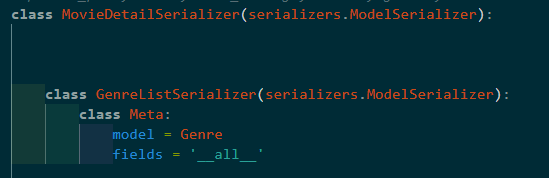

# pjt 02

## django apps / accounts, movies, reviews, tmdb models.py 및 serializers.py, views.py 작성

* accounts app
  
  * models는 AbstractUser를 사용하여 User모델 정의
  
    model User를 받아 UserSerializer 작성
- movies app
  
  - movie_list와 movie_detail 조회를 위한 url 작성
  
  - models에서 Genre 클래스와 Movie 클래스를 만들어 tmdb에서 데이터를 넘겨받을 필드들을 정의
  
  - serializers /  MovieDetailSerializer, MovieListSerializer
    
    - like_users는 UserSerializer를 사용하여 영화를 좋아하는 사용자들을 직렬화 합니다.

    - Movie모델과 Genre모델은 다대 다 관계이기때문에 detailserializer 안에 정의합니다.
    
      
    
    - UserSerializer는 Movie모델과 1대 다 혹은 대다 대 관계일 수 있습니다 따라서 detailserializer 안에 정의합니다.
    
      
    
      * views.py 
    
        * movie_detail, movie_list, tmdb에서 영화 데이터와 장르정보를 db에 저장하는 함수 작성
    
        * ```django
          from rest_framework.response import Response
          from rest_framework.decorators import api_view
          from rest_framework import status
          from django.shortcuts import get_object_or_404, get_list_or_404
          from .models import Movie, Genre
          from .serializers import MovieListSerializer, MovieDetailSerializer
          import requests
          from django.conf import settings
    
          @api_view(['GET', 'DELETE', 'PUT'])
          def movie_detail(request, movie_id):
              # article = Article.objects.get(pk=article_pk)
              movie = get_object_or_404(Movie, pk=movie_id)
    
              if request.method == 'GET':
                  serializer = MovieDetailSerializer(movie)
                  print(serializer.data)
                  return Response(serializer.data)
    
              elif request.method == 'DELETE':
                  movie.delete()
                  return Response(status=status.HTTP_204_NO_CONTENT)
    
              elif request.method == 'PUT':
                  serializer = MovieDetailSerializer(movie, data=request.data)
                  if serializer.is_valid(raise_exception=True):
                      serializer.save()
                      return Response(serializer.data)
    
    
          @api_view(['GET', 'POST'])
          # @permission_classes([IsAuthenticated])
          def movie_list(request):
              if request.method == 'GET':
    
                  movies = get_list_or_404(Movie)
                  serializer = MovieListSerializer(movies, many=True)
                  return Response(serializer.data)
    
              elif request.method == 'POST':
                  serializer = MovieDetailSerializer(data=request.data)
                  if serializer.is_valid(raise_exception=True):
                      serializer.save()
                      # serializer.save(user=request.user)
                      return Response(serializer.data, status=status.HTTP_201_CREATED)
    
    
    
          # TMDB API 키
          API_KEY = 'e8a979cfe459982651dedf077569ac57'
    
          # Django 서버 URL
          SERVER_URL = 'http://127.0.0.1:8000/'
    
          # TMDB에서 영화 데이터 가져오기
          def fetch_movies():
              url = f'https://api.themoviedb.org/3/movie/popular?api_key={API_KEY}'
              response = requests.get(url)
              if response.status_code == 200:
                  movies = response.json().get('results')
                  return movies
              else:
                  print('Error fetching movies:', response.status_code)
                  return None
    
          # 장르 정보 가져오기
          def get_genre(genre_ids):
              genres = Genre.objects.filter(id__in=genre_ids)
              return genres
    
          # 영화 데이터를 Django 서버에 저장하기
          def save_movies_to_server(movies):
              for movie in movies:
                  # 장르 정보 가져오기
                  genre_ids = movie['genre_ids']
                  genres = get_genre(genre_ids)
    
                  # Movie 모델에 데이터 저장
                  movie_obj = Movie()
                  movie_obj.title = movie['title']
                  movie_obj.release_date = movie['release_date']
                  movie_obj.vote_average = movie['vote_average']
                  movie_obj.overview = movie['overview']
                  # 필요한 영화 정보를 추가로 입력하세요
    
                  # ManyToMany 필드에 장르 추가
                  movie_obj.save()
                  movie_obj.genres.set(genres)
    
                  print(f'Movie "{movie["title"]}" saved to server.')
    
          # 메인 함수: 영화 데이터 가져오기 및 서버에 저장하기
          def main():
              movies = fetch_movies()
              if movies:
                  save_movies_to_server(movies)
    
          main()
          ```

                     

* reviews app
  
  * models.py에서 Comment 클래스를 정의합니다.
  
  * serializers.py에서 Comment model을 serializer하는 CommentSerializer를 작성합니다
  
  * views.py에서 리뷰를 작성하는 함수와 조회하는 함수를 작성합니다
    
    ```django
    @csrf_exempt
    def create_review(request, movie_id):
        if request.method == 'POST':
            movie = get_object_or_404(Movie, pk=movie_id)
            content = request.POST.get('content')
            rating = request.POST.get('rating')
    
            review = Comment(movie=movie, content=content, rating=rating)
            review.save()
    
            return JsonResponse({'message': '리뷰가 성공적으로 작성되었습니다.'})
        else:
            return JsonResponse({'error': 'POST 요청이 필요합니다.'}, status=400)
    ```

    def get_reviews(request, movie_id):
        movie = get_object_or_404(Movie, pk=movie_id)
        reviews = Comment.objects.filter(movie=movie)
        serializer = CommentSerializer(reviews, many=True)
        return JsonResponse(serializer.data, safe=False)
    
    
    ```

* tmdb app
  
  * movies의 models인 Movie와 Genre를 import하여 해당 필드들에 axios요청으로 받아온 영화 데이터들을 저장합니다.
    
    ```django
    from django.shortcuts import render
    from django.http import JsonResponse, HttpResponse
    from movies.models import Genre, Movie
    import requests
    
    # TMDB API KEY 작성
    API_KEY = 'e8a979cfe459982651dedf077569ac57'
    
    GENRE_URL = 'https://api.themoviedb.org/3/genre/movie/list'
    POPULAR_MOVIE_URL = 'https://api.themoviedb.org/3/movie/popular'
    
    def tmdb_genres():
        response = requests.get(
            GENRE_URL,
            params={
                'api_key': API_KEY,
                'language': 'ko-KR',            
            }
        ).json()    
        for genre in response.get('genres'):
            if Genre.objects.filter(pk=genre['id']).exists(): continue        
            print(genre)
            Genre.objects.create(
                id=genre['id'],
                name=genre['name']
            )
        return JsonResponse(response)
    ```

    def get_youtube_key(movie_dict):    
        movie_id = movie_dict.get('id')
        response = requests.get(
            f'https://api.themoviedb.org/3/movie/{movie_id}/videos',
            params={
                'api_key': API_KEY
            }
        ).json()
        for video in response.get('results'):
            if video.get('site') == 'YouTube':
                return video.get('key')
        return 'nothing'
    
    
    def movie_data(page=1):
        response = requests.get(
            POPULAR_MOVIE_URL,
            params={
                'api_key': API_KEY,
                'language': 'ko-kr',     
                'page': page,       
            }
        ).json()
    
        for movie_dict in response.get('results'):
            if not movie_dict.get('release_date'): continue   # 없는 필드 skip
            # 유투브 key 조회
            youtube_key = get_youtube_key(movie_dict)
    
            movie = Movie.objects.create(
                id=movie_dict.get('id'),
                title=movie_dict.get('title'),
                release_date=movie_dict.get('release_date'),
                # popularity=movie_dict.get('popularity'),
                # vote_count=movie_dict.get('vote_count'),
                vote_average=movie_dict.get('vote_average'),
                overview=movie_dict.get('overview'),
                poster_path=movie_dict.get('poster_path'),   
                youtube_key=youtube_key         
            )
            for genre_id in movie_dict.get('genre_ids', []):
                movie.genres.add(genre_id)
    
            # 배우들 저장
            print('>>>', movie.title, '==>', movie.youtube_key)
    
    def tmdb_data(request):
        Genre.objects.all().delete()
        Movie.objects.all().delete()
    
        tmdb_genres()
        for i in range(1, 6):
            movie_data(i)
        return HttpResponse('OK >>>>>>>>>>>>>>>>>>>>>>>>>>>>>>')
    ```

  기타 프론트 로그인 폼과 회원가입 폼 작성,,
